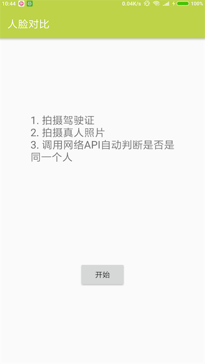
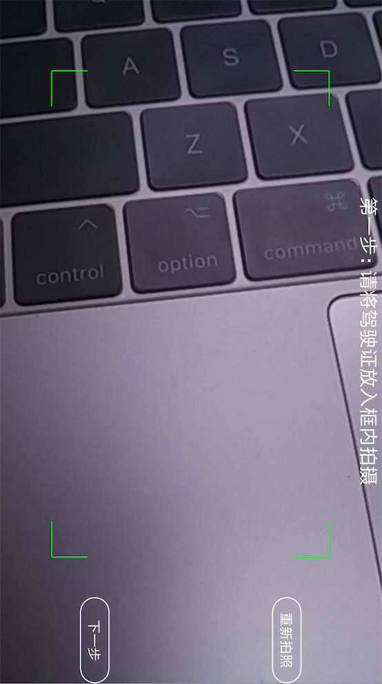
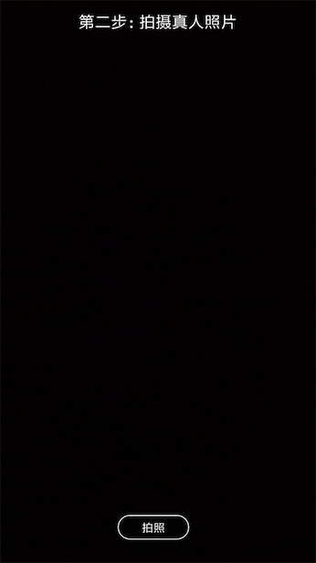
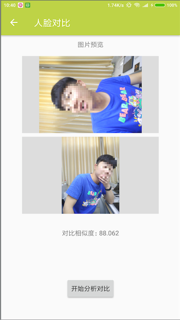

# 使用到的技术点
1. Camera2
- 使用新的Camera2API实现照相功能，此部分代码来自谷歌示例代码。
2. 自定义相机取景框
- 自定义View，实现取景框：FramView
3. 人脸对比
- 使用Face++的网络API实现，通过调用此API，传入两张图片参数，得到对比结果。

# 特别提示
项目中的相机是基于[android-Camera2Basic](https://github.com/googlesamples/android-Camera2Basic)实现。

在此基础上：
1. 处理预览界面无法全屏（黑边）。
2. 实现前后摄像头切换。
3. 自动对焦成功后，自动拍照。

# 应用截图
<!--  -->

